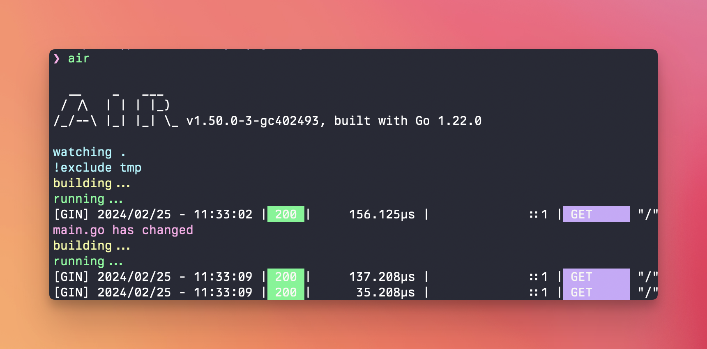

# :cloud: Air - Live reload for Go apps

[](https://github.com/cosmtrek/air/actions?query=workflow%3AGo+branch%3Amaster) [](https://www.codacy.com/gh/cosmtrek/air/dashboard?utm_source=github.com&amp;utm_medium=referral&amp;utm_content=cosmtrek/air&amp;utm_campaign=Badge_Grade) [](https://goreportcard.com/report/github.com/cosmtrek/air) [](https://codecov.io/gh/cosmtrek/air)



English | [简体中文](README-zh_cn.md) | [繁體中文](README-zh_tw.md)

## Motivation

When I started developing websites in Go and using [gin](https://github.com/gin-gonic/gin) framework, it was a pity
that gin lacked a live-reloading function. So I searched around and tried [fresh](https://github.com/pilu/fresh), it seems not much
flexible, so I intended to rewrite it better. Finally, Air's born.
In addition, great thanks to [pilu](https://github.com/pilu), no fresh, no air :)

Air is yet another live-reloading command line utility for developing Go applications. Run `air` in your project root directory, leave it alone,
and focus on your code.

Note: This tool has nothing to do with hot-deploy for production.

## Features

* Colorful log output
* Customize build or any command
* Support excluding subdirectories
* Allow watching new directories after Air started
* Better building process

### Overwrite specify configuration from arguments

Support air config fields as arguments:

If you want to config build command and run command, you can use like the following command without the config file:

`air --build.cmd "go build -o bin/api cmd/run.go" --build.bin "./bin/api"`

Use a comma to separate items for arguments that take a list as input:

`air --build.cmd "go build -o bin/api cmd/run.go" --build.bin "./bin/api" --build.exclude_dir "templates,build"`

## Installation

### Via `go install` (Recommended)

With go 1.22 or higher:

```bash
go install github.com/cosmtrek/air@latest
```

### Via install.sh

```bash
# binary will be $(go env GOPATH)/bin/air
curl -sSfL https://raw.githubusercontent.com/cosmtrek/air/master/install.sh | sh -s -- -b $(go env GOPATH)/bin

# or install it into ./bin/
curl -sSfL https://raw.githubusercontent.com/cosmtrek/air/master/install.sh | sh -s

air -v
```

### Via [goblin.run](https://goblin.run)

```sh
# binary will be /usr/local/bin/air
curl -sSfL https://goblin.run/github.com/cosmtrek/air | sh

# to put to a custom path
curl -sSfL https://goblin.run/github.com/cosmtrek/air | PREFIX=/tmp sh
```

### Docker/Podman

Please pull this docker image [cosmtrek/air](https://hub.docker.com/r/cosmtrek/air).

```bash
docker/podman run -it --rm \
    -w "<PROJECT>" \
    -e "air_wd=<PROJECT>" \
    -v $(pwd):<PROJECT> \
    -p <PORT>:<APP SERVER PORT> \
    cosmtrek/air
    -c <CONF>
```

#### Docker/Podman .${SHELL}rc

if you want to use air continuously like a normal app, you can create a function in your ${SHELL}rc (bash,zsh,etc...)

```bash
air() {
  podman/docker run -it --rm \
    -w "$PWD" -v "$PWD":"$PWD" \
    -p "$AIR_PORT":"$AIR_PORT" \
    docker.io/cosmtrek/air "$@"
}
```

`<PROJECT>` is your project path in container, eg: /go/example
if you want to enter the container, Please add --entrypoint=bash.

<details>
  <summary>For example</summary>

One of my project runs in docker:

```bash
docker run -it --rm \
  -w "/go/src/github.com/cosmtrek/hub" \
  -v $(pwd):/go/src/github.com/cosmtrek/hub \
  -p 9090:9090 \
  cosmtrek/air
```
  
Another example:

```bash
cd /go/src/github.com/cosmtrek/hub
AIR_PORT=8080 air -c "config.toml"
```

this will replace `$PWD` with the current directory, `$AIR_PORT` is the port where to publish and `$@` is to accept arguments of the application itself for example -c

</details>

## Usage

For less typing, you could add `alias air='~/.air'` to your `.bashrc` or `.zshrc`.

First enter into your project

```bash
cd /path/to/your_project
```

The simplest usage is run

```bash
# firstly find `.air.toml` in current directory, if not found, use defaults
air -c .air.toml
```

You can initialize the `.air.toml` configuration file to the current directory with the default settings running the following command.

```bash
air init
```

After this, you can just run the `air` command without additional arguments and it will use the `.air.toml` file for configuration.

```bash
air
```

For modifying the configuration refer to the [air_example.toml](air_example.toml) file.

### Runtime arguments

You can pass arguments for running the built binary by adding them after the air command.

```bash
# Will run ./tmp/main bench
air bench

# Will run ./tmp/main server --port 8080
air server --port 8080
```

You can separate the arguments passed for the air command and the built binary with `--` argument.

```bash
# Will run ./tmp/main -h
air -- -h

# Will run air with custom config and pass -h argument to the built binary
air -c .air.toml -- -h
```

### Docker-compose

```yaml
services:
  my-project-with-air:
    image: cosmtrek/air
    # working_dir value has to be the same of mapped volume
    working_dir: /project-package
    ports:
      - <any>:<any>
    environment:
      - ENV_A=${ENV_A}
      - ENV_B=${ENV_B}
      - ENV_C=${ENV_C}
    volumes:
      - ./project-relative-path/:/project-package/
```

### Debug

`air -d` prints all logs.

## Installation and Usage for Docker users who don't want to use air image

`Dockerfile`

```Dockerfile
# Choose whatever you want, version >= 1.16
FROM golang:1.22-alpine

WORKDIR /app

RUN go install github.com/cosmtrek/air@latest

COPY go.mod go.sum ./
RUN go mod download

CMD ["air", "-c", ".air.toml"]
```

`docker-compose.yaml`

```yaml
version: "3.8"
services:
  web:
    build:
      context: .
      # Correct the path to your Dockerfile
      dockerfile: Dockerfile
    ports:
      - 8080:3000
    # Important to bind/mount your codebase dir to /app dir for live reload
    volumes:
      - ./:/app
```

## Q&A

### "command not found: air" or "No such file or directory"

```zsh
export GOPATH=$HOME/xxxxx
export PATH=$PATH:$GOROOT/bin:$GOPATH/bin
export PATH=$PATH:$(go env GOPATH)/bin <---- Confirm this line in you profile!!!
```

### Error under wsl when ' is included in the bin

Should use `\` to escape the `' in the bin. related issue: [#305](https://github.com/cosmtrek/air/issues/305)

### Question: how to do hot compile only and do not run anything? 

[#365](https://github.com/cosmtrek/air/issues/365)

```toml
[build]
  cmd = "/usr/bin/true"
```

## Development

Please note that it requires Go 1.16+ since I use `go mod` to manage dependencies.

```bash
# Fork this project

# Clone it
mkdir -p $GOPATH/src/github.com/cosmtrek
cd $GOPATH/src/github.com/cosmtrek
git clone git@github.com:<YOUR USERNAME>/air.git

# Install dependencies
cd air
make ci

# Explore it and happy hacking!
make install
```

Pull requests are welcome.

### Release

```bash
# Checkout to master
git checkout master

# Add the version that needs to be released
git tag v1.xx.x

# Push to remote
git push origin v1.xx.x

# The CI will process and release a new version. Wait about 5 min, and you can fetch the latest version
```

## Star History

[](https://star-history.com/#cosmtrek/air&Date)

## Sponsor

[](https://www.buymeacoffee.com/cosmtrek)

Give huge thanks to lots of supporters. I've always been remembering your kindness.

## License

[GNU General Public License v3.0](LICENSE)
